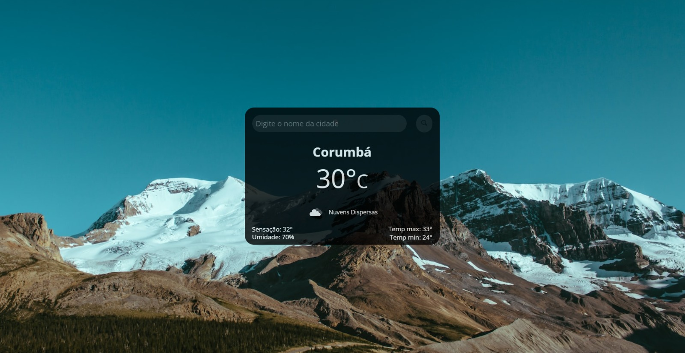
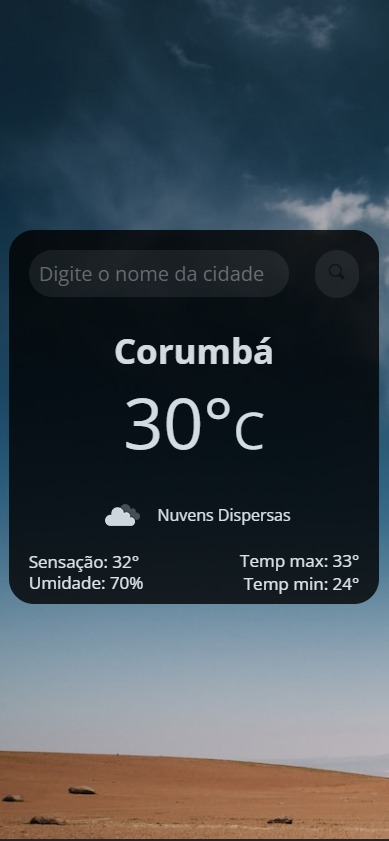

<h1 align="center"> Dev Previsão </h1>

 

<h3 align="center"> <b>📱 Responsivo</b></h3>
 

## 🚀 Tecnologias

Esse projeto foi desenvolvido com as seguintes tecnologias:

- HTML e CSS
- JavaScript
- Axios

## 💻 Projeto

Aplicação de previsão do tempo, integrando uma API que retorna dados meteorológicos atualizados em tempo real. Essa aplicação permitiu que os usuários obtivessem informações precisas sobre o clima, auxiliando no planejamento de suas atividades diárias e agregando valor ao fornecer insights úteis para tomadas de decisão.

## 👨🏻‍💻 Deploy

<a target="_blank" href="https://weatherdevv.netlify.app/"><b>CLICK PARA ACESSAR!</b></a>

## 🌎<i>Onde me encontrar:</i>  

  
   
  

